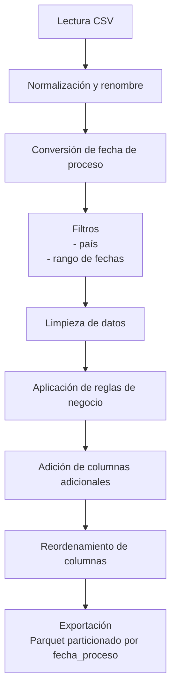

# Caso de Ingeniería de Datos

Proyecto de ETL en PySpark para procesar un archivo de entregas de producto.  
El flujo lee un CSV, normaliza columnas, aplica reglas de negocio, filtra por país y rango de fechas (configurados en `config.yaml`), genera columnas adicionales y guarda el resultado en formato Parquet particionado por `fecha_proceso`.  

## Estructura
- `etl.py`: script principal
- `config.yaml`: parámetros del proceso
- `data/raw/data_entrega_productos.csv`: archivo CSV crudo
- `exploracion_datos.ipynb`: análisis exploratorio preliminar

## Ejecución

Ejecutar mediante el siguiente comando:

```
python etl.py
```

Los resultados se almancena en el `output_path` definido a continuación

```
data/processed/
```

## Flujo del ETL



El proceso inicia con la lectura del archivo CSV original.  
Luego se normalizan las columnas, se convierte la fecha de proceso y se aplican filtros por rango de fechas y país (según YAML).  
Se eliminan valores nulos o anómalos y se aplican reglas de negocio para validar tipos de entrega y unificar unidades.
Después se generan columnas adicionales (descripciones, rangos y campos derivados) y se ordena el esquema final.  
Finalmente, el resultado se escribe en formato Parquet particionado por `fecha_proceso`.

## Dependencias

El proyecto fue desarrollado con las siguientes versiones de Python y librerías:

- Python 3.10+
- pyspark 3.5.1
- omegaconf 2.3.0
- pandas 2.3.3
- pyarrow 22.0.0

